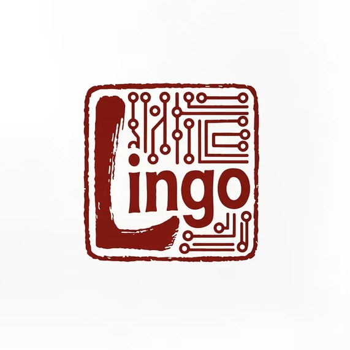

# Lingo - 智能文创平台

<p align="center">
  
</p>

<p align="center">
  <strong>用 AI 创造文创新纪元</strong>
</p>

<p align="center">
  <a href="#project-introduction">项目简介</a> •
  <a href="#core-features">核心功能</a> •
  <a href="#tech-stack">技术栈</a> •
  <a href="#quick-start">快速开始</a> •
  <a href="#project-structure">项目结构</a> •
  <a href="#deployment-guide">部署指南</a> •
  <a href="#contributing">贡献指南</a> •
  <a href="#license">许可证</a>
</p>

<p align="center">
  
  
  
</p>

## 🌟 项目简介 <a id="project-introduction"></a>

**Lingo** 是一个基于人工智能的文创设计平台，致力于将传统艺术与现代技术完美融合。通过先进的AI算法，我们赋能创作者快速生成独特的文创设计，从传统纹样到国潮风格，让创意无限延伸。

### ✨ 特色亮点

- 🎨 **AI智能生成** - 基于深度学习的纹样生成算法
- 🏛️ **传统与现代融合** - 结合传统艺术与现代设计趋势
- 🎯 **参数化设计** - 精准控制生成效果
- 👥 **创作者社区** - 活跃的交流分享平台
- 💼 **商业授权** - 完善的版权保护机制

## 🚀 核心功能 <a id="core-features"></a>

### 1. AI纹样生成器
- **多种风格选择**：传统纹样、国潮风格、水墨风格、极简主义
- **参数化调节**：复杂度、色彩方案、关键词描述
- **实时预览**：即时生成效果展示
- **批量生成**：支持多种参数组合生成

### 2. 文创展示平台
- **作品展示**：展示用户生成的文创设计
- **社区互动**：点赞、评论、收藏功能
- **版权保护**：水印保护、作品溯源
- **商业授权**：支持作品商业化

### 3. 创作者社区
- **经验分享**：文创设计技巧交流
- **活动参与**：设计大赛、工作坊
- **合作机会**：创作者与品牌对接

### 4. 会员服务
- **免费版**：基础功能体验
- **创作者版**：专业创作工具
- **企业版**：团队协作功能

## 🛠️ 技术栈 <a id="tech-stack"></a>

### 前端技术
- **HTML5** - 语义化标记
- **CSS3** - 现代样式设计
- **Tailwind CSS** - 实用优先的CSS框架
- **JavaScript** - 交互逻辑实现
- **Font Awesome** - 图标库

### 后端技术
- **Python** - 服务器部署
- **HTTP Server** - 轻量级Web服务器

### 开发工具
- **Visual Studio Code** - 代码编辑器
- **Git** - 版本控制

## 🎯 快速开始 <a id="quick-start"></a>

### 环境要求
- Python 3.6+
- 现代浏览器（Chrome、Firefox、Safari、Edge）

### 本地运行

1. **克隆项目**
   ```bash
   git clone https://github.com/Miloboxgithub/Lingo.git
   cd Lingo
   ```

2. **启动服务器**
   ```bash
   python deploy_server.py
   ```

3. **访问应用**
   打开浏览器访问：`http://localhost:8080`

### 生产部署

1. **配置服务器**
   ```bash
   # 安装依赖（如有）
   pip install -r requirements.txt
   ```

2. **启动服务**
   ```bash
   python deploy_server.py
   ```

3. **配置反向代理**（可选）
   ```nginx
   server {
       listen 80;
       server_name your-domain.com;
       
       location / {
           proxy_pass http://localhost:8080;
           proxy_set_header Host $host;
           proxy_set_header X-Real-IP $remote_addr;
       }
   }
   ```

## 📁 项目结构 <a id="project-structure"></a>

```
Lingo/
├── index.html              # 主页面
├── generator.html          # AI生成器页面
├── works.html             # 作品展示页面
├── community.html         # 社区页面
├── pricing.html           # 定价页面
├── login.html             # 登录页面
├── register.html          # 注册页面
├── profile.html           # 个人中心页面
├── index.css              # 样式文件
├── logo.jpg               # 项目Logo
├── logo.svg               # SVG Logo
├── logo_simple.svg        # 简化版Logo
├── deploy_server.py       # 部署服务器脚本
└── .gitignore            # Git忽略文件
```

### 页面说明

- **index.html** - 项目主页，展示平台特色和功能
- **generator.html** - AI纹样生成器，核心功能页面
- **works.html** - 文创作品展示和浏览
- **community.html** - 创作者社区和交流平台
- **pricing.html** - 会员定价和功能对比
- **login.html** - 用户登录页面
- **register.html** - 用户注册页面
- **profile.html** - 个人中心和管理页面

## 🎨 设计特色 <a id="design-features"></a>

### 视觉设计
- **色彩方案**：以金色(#E6A42A)为主色调，体现文创的典雅与价值
- **字体选择**：Noto Serif SC（中文字体）+ Poppins（英文字体）
- **响应式设计**：完美适配桌面端和移动端
- **交互动效**：流畅的过渡动画和悬停效果

### 用户体验
- **直观操作**：简洁明了的界面设计
- **实时反馈**：操作即时响应
- **渐进增强**：基础功能优先，高级功能渐进

## 🔧 部署指南 <a id="deployment-guide"></a>

### 本地开发

1. **环境配置**
   ```bash
   # 确保Python环境
   python --version
   ```

2. **启动开发服务器**
   ```bash
   python deploy_server.py
   ```

3. **访问测试**
   - 本地访问：`http://localhost:8080`
   - 局域网访问：`http://[你的IP]:8080`

### 生产环境

1. **服务器准备**
   - 确保80/443端口开放
   - 配置域名解析

2. **部署步骤**
   ```bash
   # 上传项目文件
   scp -r Lingo/ user@server:/path/to/project/
   
   # 服务器启动
   cd /path/to/project
   nohup python deploy_server.py &
   ```

3. **监控维护**
   - 使用`htop`监控进程
   - 配置日志轮转
   - 定期备份数据

## 🤝 贡献指南 <a id="contributing"></a>

我们欢迎所有形式的贡献！请阅读以下指南：

### 报告问题
- 使用 [Issues](https://github.com/Miloboxgithub/Lingo/issues) 报告bug或建议
- 提供详细的问题描述和复现步骤

### 提交代码
1. Fork 项目
2. 创建功能分支 (`git checkout -b feature/AmazingFeature`)
3. 提交更改 (`git commit -m 'Add some AmazingFeature'`)
4. 推送到分支 (`git push origin feature/AmazingFeature`)
5. 开启 Pull Request

### 开发规范
- 遵循现有的代码风格
- 添加适当的注释
- 确保代码通过测试
- 更新相关文档

## 📝 更新日志 <a id="changelog"></a>

### v1.0.0 (2025-10-1)
- ✅ 基础平台功能完成
- ✅ AI纹样生成器
- ✅ 用户认证系统
- ✅ 响应式设计
- ✅ 部署脚本

## 🐛 常见问题 <a id="faq"></a>

### Q: 如何获得更多生成次数？
A: 免费用户每月有5次生成额度，可以升级到创作者版获得更多生成机会。

### Q: 生成的设计可以商用吗？
A: 免费版仅限个人非商业用途，创作者版和企业版提供商业授权。

### Q: 支持哪些文件格式导出？
A: 目前支持PNG格式导出，后续将支持SVG、JPG等格式。

### Q: 如何保护我的创意？
A: 我们提供水印保护、版权登记和作品溯源等多重保护机制。

## 📄 许可证 <a id="license"></a>

本项目采用 MIT 许可证 - 查看 [LICENSE]() 文件了解详情。

## 📞 联系我们 <a id="contact"></a>

- **邮箱**: 
- **电话**: 
- **地址**: 
- **社交媒体**: 
  - 微博: [@Lingo文创]()
  - 微信: 
  - Instagram: [@lingo.design]()

## 🙏 致谢 <a id="acknowledgments"></a>

感谢所有为这个项目做出贡献的开发者、设计师和测试人员！

---

<p align="center">
  Made with ❤️ by <a href="">Milobox</a>
</p>

<p align="center">
  <sub>如果这个项目对你有帮助，请给个 ⭐️ 支持一下！</sub>
</p>
